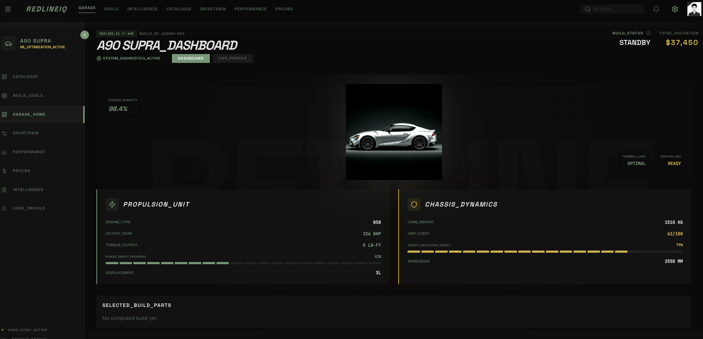
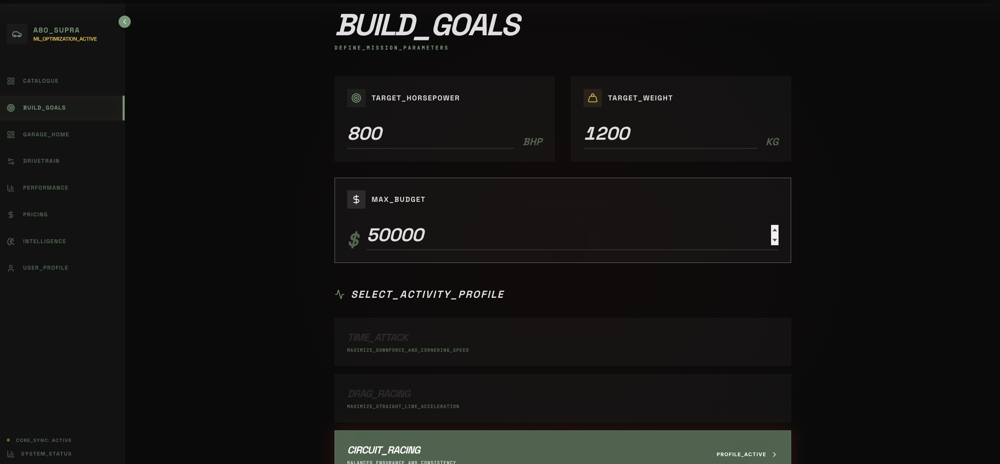
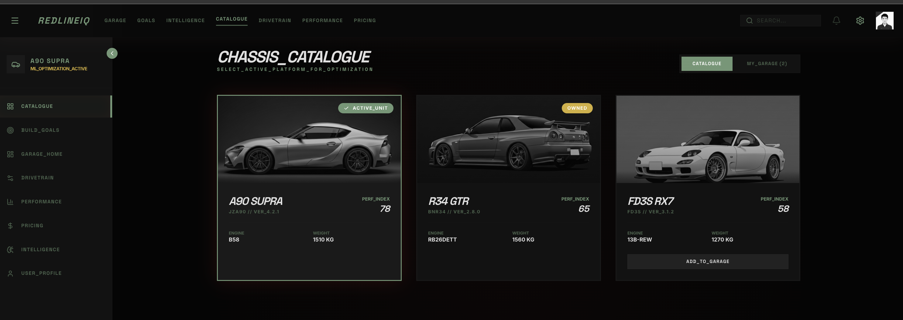

# RedlineIQ

## GOAL
RedlineIQ is an intelligent racecar/build planning platform that can answer these questions:
- What parts combination gets me to 500 whp on a GR Supra within budget?
- What supporting mods are required for this target?
- What reliability risk am I creating?
- What setup is best for drag / street / track / time attack?
- Which build path is most cost-efficient?
- What real-world community evidence supports that recommendation?

## Demo Screenshots

## Screenshots

### Dashboard View
 

### Build Optimizer
 

### Garage Catalog Page

## Tools
- PostgreSQL = storage
- SQLAlchemy = database objects
- Pydantic = API contracts
- FastAPI = backend interface
    - FastAPI is responsible for:
        - receiving HTTP requests
        - validating incoming data
        - getting a database session
        - calling your engine logic
        - returning structured JSON responses
- Engine = decision logic
- Frontend = display layer
- ML = intelligence layer

## Resources and Links
- https://www.ultimatespecs.com/car-specs/Toyota/145989/Toyota-GR-Supra-30.html
- a90shop.com
- https://www.startmycar.com/us

